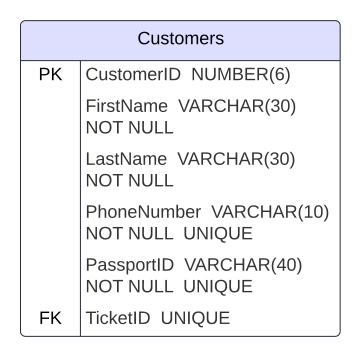
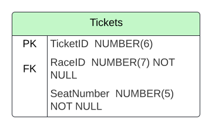
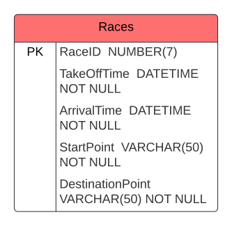
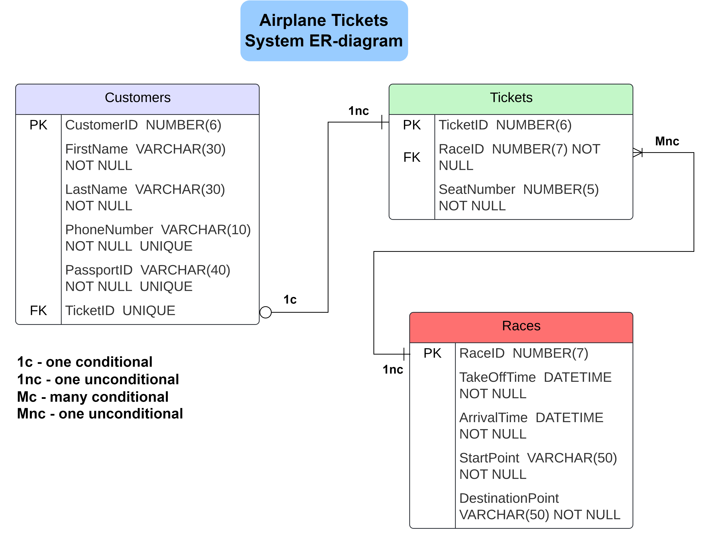

# Simple Airplane Tickets System

## Designing a database using ER-diagram

### Defining entities, their attributes, and relations.

## 
*Customers*

First of all the system will contain a table dedicated to customers that we'll be using the service of the airplane company. They will buy the tickets for different airplane races. The Customers table must contain personal information about a person, for example: firstName, lastName, phone number, passportID and a TicketID attribute that will notify about the race the customer's picked. It will have a one to one relationship with the Tickets table. 
 

  

## 
*Tickets*

The ticket entity signifies tickets the customers buy for different airplane races. The table for that entity will contain RaceID attribute telling about the race this ticket is meant for, seatNumber attribute. This table will have one-to-many relationship with Races table.
 

  

## 
*Races*

The race entity enbodies the races for different destinations that the airport can get people to. THe attributes it will have are: RaceID, takeOffTime, arrivalTime, startPoint, destinationPoint.
 

  

## ER-diagram depicting the designed entities, their attributes with data types, and relationships

### Let's apply our referential integrity restrictions and define relations between tables in our database

## 
*ER-diagram*

  

